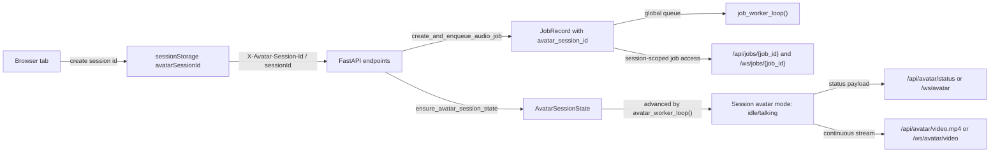

# Avatar Session Architecture

## Scope

This document describes the current avatar interaction model after session isolation was introduced.

The scope covers:

- browser session identification
- backend session state management
- avatar status and video streaming
- job enqueue and per-job access control
- the execution boundary between per-session playback and the global render worker

## Session Contract

Each browser tab creates one stable avatar interaction session id and reuses it for the lifetime of that tab.

Verified facts:

| Fact | Source |
| --- | --- |
| The frontend creates a per-tab session id and stores it in `sessionStorage` under `avatarSessionId`. | [index.html](../index.html#L956) |
| The frontend sends the session id in the `X-Avatar-Session-Id` header for API requests. | [index.html](../index.html#L1705) |
| The frontend appends the session id as `sessionId` to websocket URLs. | [index.html](../index.html#L2645) |
| The backend accepts `X-Avatar-Session-Id` and `sessionId`. | [realtime_stream_api.py](../realtime_stream_api.py#L530), [realtime_stream_api.py](../realtime_stream_api.py#L531), [realtime_stream_api.py](../realtime_stream_api.py#L3049), [realtime_stream_api.py](../realtime_stream_api.py#L3077) |
| Session ids must match `^[A-Za-z0-9_-]{1,128}$`. | [realtime_stream_api.py](../realtime_stream_api.py#L533) |

## Runtime Components

| Component | Responsibility | Source |
| --- | --- | --- |
| `JobRecord.avatar_session_id` | Associates every generated speaking job with one interaction session. | [realtime_stream_api.py](../realtime_stream_api.py#L1685) |
| `AvatarSessionState` | Stores the current avatar mode, active job, timestamps, and sequence for one session. | [realtime_stream_api.py](../realtime_stream_api.py#L1743) |
| `JOBS` + `job_worker_loop()` | Keeps one global render queue and executes speaking jobs sequentially. | [realtime_stream_api.py](../realtime_stream_api.py#L2954) |
| `AVATAR_SESSION_STATES` + `avatar_worker_loop()` | Keeps independent playback state per session and advances each active session in polling cycles. | [realtime_stream_api.py](../realtime_stream_api.py#L2828), [realtime_stream_api.py](../realtime_stream_api.py#L3532) |
| `build_avatar_payload()` | Builds the avatar state payload for one specific session. | [realtime_stream_api.py](../realtime_stream_api.py#L3166) |
| `build_public_avatar_health_payload()` | Builds a session-neutral payload for infrastructure health checks when no session id is provided. | [realtime_stream_api.py](../realtime_stream_api.py#L3202) |

## Request and Playback Flow

## Frontend Behavior

The browser keeps one session id per tab and sends it automatically through all avatar-related requests.

Verified facts:

| Fact | Source |
| --- | --- |
| The frontend stores the generated session id in the local avatar state object. | [index.html](../index.html#L1264), [index.html](../index.html#L3352), [index.html](../index.html#L3826) |
| `createJob()` still uses `POST /api/avatar/enqueue`, but the request now includes the session header through `buildApiRequestOptions()`. | [index.html](../index.html#L1705), [index.html](../index.html#L3546) |
| `checkApiHealth()` reads `avatarSessionId` and the session-scoped `avatarQueueDepth` from `/api/health`. | [index.html](../index.html#L3787), [index.html](../index.html#L3826), [index.html](../index.html#L3841) |
| All websocket URLs include `sessionId` through `buildWebSocketUrl()`. | [index.html](../index.html#L2645) |

## Backend Session Resolution

The backend creates or reuses an `AvatarSessionState` bucket when a valid session id is provided.

Verified facts:

| Fact | Source |
| --- | --- |
| HTTP avatar requests use `get_avatar_session_id_from_request()` when a session is required. | [realtime_stream_api.py](../realtime_stream_api.py#L3049) |
| `/api/health` uses `get_optional_avatar_session_id_from_request()` so probes can stay session-neutral. | [realtime_stream_api.py](../realtime_stream_api.py#L3062), [realtime_stream_api.py](../realtime_stream_api.py#L5286) |
| Websocket avatar requests use `get_avatar_session_id_from_websocket()`. | [realtime_stream_api.py](../realtime_stream_api.py#L3077) |
| `ensure_avatar_session_state()` creates the session state on first use and returns the existing bucket on later requests. | [realtime_stream_api.py](../realtime_stream_api.py#L3036) |

## Session-Scoped Endpoints

The following endpoints now depend on the caller session:

| Endpoint | Session behavior | Source |
| --- | --- | --- |
| `GET /api/health` | Returns session-scoped avatar fields when a session id is provided; returns a public health payload otherwise. | [realtime_stream_api.py](../realtime_stream_api.py#L5286) |
| `GET /api/avatar/status` | Returns only the avatar state for the requested session. | [realtime_stream_api.py](../realtime_stream_api.py#L5386) |
| `POST /api/generate` | Enqueues a job for the provided session. | [realtime_stream_api.py](../realtime_stream_api.py#L5477), [realtime_stream_api.py](../realtime_stream_api.py#L5097) |
| `POST /api/avatar/enqueue` | Enqueues a job for the provided session. | [realtime_stream_api.py](../realtime_stream_api.py#L5523), [realtime_stream_api.py](../realtime_stream_api.py#L5097) |
| `POST /api/webrtc/offer` | Creates a WebRTC session tied to one avatar interaction session. | [realtime_stream_api.py](../realtime_stream_api.py#L5392), [realtime_stream_api.py](../realtime_stream_api.py#L2205) |
| `GET /api/avatar/video.mp4` | Streams only the idle/talking timeline of the requested session. | [realtime_stream_api.py](../realtime_stream_api.py#L5693), [realtime_stream_api.py](../realtime_stream_api.py#L2548) |
| `WS /ws/avatar` | Pushes only the status changes for the requested session. | [realtime_stream_api.py](../realtime_stream_api.py#L5785) |
| `WS /ws/avatar/video` | Pushes only the continuous avatar stream for the requested session. | [realtime_stream_api.py](../realtime_stream_api.py#L5760), [realtime_stream_api.py](../realtime_stream_api.py#L2548) |
| `WS /ws/jobs/{job_id}` | Rejects access when the job belongs to a different session. | [realtime_stream_api.py](../realtime_stream_api.py#L5634) |
| `WS /ws/jobs/{job_id}/video` | Rejects access when the job belongs to a different session. | [realtime_stream_api.py](../realtime_stream_api.py#L5819) |

## Scheduling Model

The system now separates playback state per session, but render execution remains global.

Verified facts:

| Fact | Source |
| --- | --- |
| `job_worker_loop()` still consumes the global `JOB_QUEUE` sequentially. | [realtime_stream_api.py](../realtime_stream_api.py#L2954) |
| `AvatarSessionState` stores the active talking job and idle timestamps independently for each session. | [realtime_stream_api.py](../realtime_stream_api.py#L1743) |
| `get_avatar_state_snapshot()` reads only one session bucket and resolves the current job inside that session. | [realtime_stream_api.py](../realtime_stream_api.py#L3096) |
| `select_next_avatar_job()` filters jobs by `avatar_session_id`. | [realtime_stream_api.py](../realtime_stream_api.py#L3344) |
| `advance_avatar_state_machine()` operates on one session at a time. | [realtime_stream_api.py](../realtime_stream_api.py#L3423) |
| `avatar_worker_loop()` iterates over all active session ids and advances them independently. | [realtime_stream_api.py](../realtime_stream_api.py#L3532) |

## Continuous Avatar Stream

The continuous avatar stream is still one idle/talking composition pipeline, but it now reads the scheduler snapshot of one session.

Verified facts:

| Fact | Source |
| --- | --- |
| `stream_continuous_avatar_video()` now takes `avatar_session_id` and reads only that session snapshot. | [realtime_stream_api.py](../realtime_stream_api.py#L2548), [realtime_stream_api.py](../realtime_stream_api.py#L2694) |
| `pump_continuous_avatar_audio()` now takes `avatar_session_id` and switches speaking audio based on that session snapshot. | [realtime_stream_api.py](../realtime_stream_api.py#L2464), [realtime_stream_api.py](../realtime_stream_api.py#L2477) |
| `AvatarWebRtcSession` binds one peer connection to one avatar session id. | [realtime_stream_api.py](../realtime_stream_api.py#L2205) |

## Access Control for Job Resources

Job resources are now session-aware.

Verified facts:

| Fact | Source |
| --- | --- |
| `get_job(job_id, avatar_session_id)` returns `404` when the job belongs to a different session. | [realtime_stream_api.py](../realtime_stream_api.py#L2902) |
| Job payloads include `avatarSessionId`. | [realtime_stream_api.py](../realtime_stream_api.py#L4943) |
| The benchmark utility was updated to send `X-Avatar-Session-Id` for health, enqueue, status, and report calls. | [scripts/benchmark_docker_backends.py](../scripts/benchmark_docker_backends.py#L43), [scripts/benchmark_docker_backends.py](../scripts/benchmark_docker_backends.py#L169), [scripts/benchmark_docker_backends.py](../scripts/benchmark_docker_backends.py#L181), [scripts/benchmark_docker_backends.py](../scripts/benchmark_docker_backends.py#L521) |

## Current Execution Boundary

The current design isolates what each client sees and controls, but not the render worker itself.

Confirmed boundary:

- speaking jobs are tagged by session and exposed only to that session
- avatar idle/talking state is tracked independently per session
- avatar status/video/websocket playback is isolated per session
- the render queue is still global and sequential

