# Runpod TRT Deployment

## Scope

This runbook deploys the realtime avatar API on Runpod Pods with `TensorRT` as the only supported inference backend for this flow.

The Pod does not run `shaoguo/faster_liveportrait:v3` directly. It runs a derived image built from [Dockerfile.runpod](/e:/animation/Dockerfile.runpod), which keeps the TRT8 userspace from that base image and adds the Runpod bootstrap bundle.

## Verified Repository Facts

| Fact | Source |
| --- | --- |
| The Runpod image is based on `shaoguo/faster_liveportrait:v3`. | [Dockerfile.runpod](/e:/animation/Dockerfile.runpod#L1) |
| The Runpod image forces `LD_LIBRARY_PATH=/opt/TensorRT-8.6.1.6/lib`. | [Dockerfile.runpod](/e:/animation/Dockerfile.runpod#L17) |
| The image entrypoint is `bash /app/scripts/runpod_image_start.sh`. | [Dockerfile.runpod](/e:/animation/Dockerfile.runpod#L26) |
| The image bundles the Runpod overrides under `/app/runpod-bundle`, including `requirements-runpod.txt`, `scripts/bootstrap_faster_liveportrait.sh`, `scripts/runpod_bootstrap.sh`, `scripts/runpod_validate_runtime.sh`, `faster_liveportrait_runner.py`, and the selected `third_party/FasterLivePortrait` overrides. | [Dockerfile.runpod](/e:/animation/Dockerfile.runpod#L20), [Dockerfile.runpod](/e:/animation/Dockerfile.runpod#L21), [Dockerfile.runpod](/e:/animation/Dockerfile.runpod#L22), [Dockerfile.runpod](/e:/animation/Dockerfile.runpod#L23), [Dockerfile.runpod](/e:/animation/Dockerfile.runpod#L24), [Dockerfile.runpod](/e:/animation/Dockerfile.runpod#L25), [Dockerfile.runpod](/e:/animation/Dockerfile.runpod#L26), [Dockerfile.runpod](/e:/animation/Dockerfile.runpod#L27), [Dockerfile.runpod](/e:/animation/Dockerfile.runpod#L28), [Dockerfile.runpod](/e:/animation/Dockerfile.runpod#L29), [Dockerfile.runpod](/e:/animation/Dockerfile.runpod#L30), [Dockerfile.runpod](/e:/animation/Dockerfile.runpod#L31), [Dockerfile.runpod](/e:/animation/Dockerfile.runpod#L32), [Dockerfile.runpod](/e:/animation/Dockerfile.runpod#L33), [Dockerfile.runpod](/e:/animation/Dockerfile.runpod#L34), [Dockerfile.runpod](/e:/animation/Dockerfile.runpod#L35), [Dockerfile.runpod](/e:/animation/Dockerfile.runpod#L36) |
| The image startup script executes the repo bootstrap from the cloned workspace. | [scripts/runpod_image_start.sh](/e:/animation/scripts/runpod_image_start.sh#L24), [scripts/runpod_image_start.sh](/e:/animation/scripts/runpod_image_start.sh#L26) |
| The entrypoint clones `https://github.com/PailletJuanPablo/avatario.git` at `main` into `/workspace/animation`. | [scripts/runpod_entrypoint.sh](/e:/animation/scripts/runpod_entrypoint.sh#L5), [scripts/runpod_entrypoint.sh](/e:/animation/scripts/runpod_entrypoint.sh#L6), [scripts/runpod_entrypoint.sh](/e:/animation/scripts/runpod_entrypoint.sh#L7), [scripts/runpod_entrypoint.sh](/e:/animation/scripts/runpod_entrypoint.sh#L8) |
| The entrypoint overlays the cloned repo with the bundled Runpod files before executing the bootstrap, and the bootstrap applies the bundled `FasterLivePortrait` overrides after cloning the upstream dependency. | [scripts/runpod_entrypoint.sh](/e:/animation/scripts/runpod_entrypoint.sh#L86), [scripts/runpod_entrypoint.sh](/e:/animation/scripts/runpod_entrypoint.sh#L122), [scripts/runpod_entrypoint.sh](/e:/animation/scripts/runpod_entrypoint.sh#L127), [scripts/runpod_bootstrap.sh](/e:/animation/scripts/runpod_bootstrap.sh#L429), [scripts/runpod_bootstrap.sh](/e:/animation/scripts/runpod_bootstrap.sh#L731) |
| The bootstrap only supports `ANIMATION_BACKEND=trt`. | [scripts/runpod_bootstrap.sh](/e:/animation/scripts/runpod_bootstrap.sh#L717), [scripts/runpod_bootstrap.sh](/e:/animation/scripts/runpod_bootstrap.sh#L718) |
| The bootstrap defaults are `ANIMATION_API_PORT=8010`, `ANIMATION_TRT_RUNTIME=docker`, `ANIMATION_TRT_PRECISION=fp16`, and `ANIMATION_IDLE_VIDEO=inputs/idlevid_breath.mp4`. | [scripts/runpod_bootstrap.sh](/e:/animation/scripts/runpod_bootstrap.sh#L12), [scripts/runpod_bootstrap.sh](/e:/animation/scripts/runpod_bootstrap.sh#L15), [scripts/runpod_bootstrap.sh](/e:/animation/scripts/runpod_bootstrap.sh#L16), [scripts/runpod_bootstrap.sh](/e:/animation/scripts/runpod_bootstrap.sh#L17) |
| The bootstrap repairs broken NVIDIA driver links such as `libcuda.so.1` and `libnvidia-ml.so.1` before validating CUDA. | [scripts/runpod_bootstrap.sh](/e:/animation/scripts/runpod_bootstrap.sh#L147), [scripts/runpod_bootstrap.sh](/e:/animation/scripts/runpod_bootstrap.sh#L183), [scripts/runpod_bootstrap.sh](/e:/animation/scripts/runpod_bootstrap.sh#L202) |
| The bootstrap downloads checkpoints from `warmshao/FasterLivePortrait`, `jdh-algo/JoyVASA`, and `TencentGameMate/chinese-hubert-base`. | [scripts/runpod_bootstrap.sh](/e:/animation/scripts/runpod_bootstrap.sh#L18), [scripts/runpod_bootstrap.sh](/e:/animation/scripts/runpod_bootstrap.sh#L19), [scripts/runpod_bootstrap.sh](/e:/animation/scripts/runpod_bootstrap.sh#L20), [scripts/runpod_bootstrap.sh](/e:/animation/scripts/runpod_bootstrap.sh#L491) |
| The bootstrap removes incomplete `third_party/FasterLivePortrait` clones, applies the bundled overrides, and generates `output/frames` plus `output/meta.json` from `inputs/idlevid_breath.mp4` when those assets are missing. | [scripts/runpod_bootstrap.sh](/e:/animation/scripts/runpod_bootstrap.sh#L412), [scripts/runpod_bootstrap.sh](/e:/animation/scripts/runpod_bootstrap.sh#L429), [scripts/runpod_bootstrap.sh](/e:/animation/scripts/runpod_bootstrap.sh#L447), [scripts/runpod_bootstrap.sh](/e:/animation/scripts/runpod_bootstrap.sh#L730), [scripts/runpod_bootstrap.sh](/e:/animation/scripts/runpod_bootstrap.sh#L731) |
| The bootstrap can delete prebuilt `.trt` plans when `RUNPOD_FORCE_TRT_REBUILD=1`. | [scripts/runpod_bootstrap.sh](/e:/animation/scripts/runpod_bootstrap.sh#L557), [scripts/runpod_bootstrap.sh](/e:/animation/scripts/runpod_bootstrap.sh#L560), [scripts/runpod_bootstrap.sh](/e:/animation/scripts/runpod_bootstrap.sh#L726) |
| The bundled validation script checks CUDA, `trt.Builder(...)`, the TRT plugin, `/api/health`, and waits for warmup to finish without `warmupError`. | [scripts/runpod_validate_runtime.sh](/e:/animation/scripts/runpod_validate_runtime.sh#L100), [scripts/runpod_validate_runtime.sh](/e:/animation/scripts/runpod_validate_runtime.sh#L117), [scripts/runpod_validate_runtime.sh](/e:/animation/scripts/runpod_validate_runtime.sh#L119), [scripts/runpod_validate_runtime.sh](/e:/animation/scripts/runpod_validate_runtime.sh#L123), [scripts/runpod_validate_runtime.sh](/e:/animation/scripts/runpod_validate_runtime.sh#L124) |
| The local publish helper defaults to `pailletjp/avatario-runpod:thin` and can skip the `latest` tag. | [scripts/build_runpod_image.ps1](/e:/animation/scripts/build_runpod_image.ps1#L1), [scripts/build_runpod_image.ps1](/e:/animation/scripts/build_runpod_image.ps1#L2), [scripts/build_runpod_image.ps1](/e:/animation/scripts/build_runpod_image.ps1#L5), [scripts/build_runpod_image.ps1](/e:/animation/scripts/build_runpod_image.ps1#L30), [scripts/build_runpod_image.ps1](/e:/animation/scripts/build_runpod_image.ps1#L36) |

## Preconditions

1. Docker Desktop is installed on the local machine that will publish the image.
2. Docker is authenticated against Docker Hub on that machine.
3. The local workspace contains this repository and the current `Dockerfile.runpod` plus Runpod scripts.
4. A Runpod account is available and can create Pods.
5. If SSH access is required, the public SSH key is already added to the Runpod account before creating the Pod.

## Base Image Boundary

This repository's Runpod image is intentionally derived from `shaoguo/faster_liveportrait:v3` because [Dockerfile.runpod](/e:/animation/Dockerfile.runpod#L17) points the runtime to `/opt/TensorRT-8.6.1.6/lib`.

That choice preserves the TRT8 userspace that matches the local flow validated for this project. It is not a statement that the upstream `shaoguo/faster_liveportrait:v3` image is universally safe to run on Runpod without checks.

Runpod compatibility is accepted only after the Pod passes the runtime validation described in this runbook.

The deployment flow in this repository does not depend on `/start.sh`. The image entrypoint is [scripts/runpod_image_start.sh](/e:/animation/scripts/runpod_image_start.sh), which directly executes [scripts/runpod_entrypoint.sh](/e:/animation/scripts/runpod_entrypoint.sh).

## Safe Deployment Sequence

```mermaid
flowchart LR
    A["Local machine"] -->|"build_runpod_image.ps1"| B["Docker Hub: pailletjp/avatario-runpod:thin"]
    B -->|"Runpod pulls image"| C["Runpod Pod"]
    C -->|"runpod_image_start.sh"| D["Clone repo into /workspace/animation"]
    D -->|"runpod_entrypoint.sh"| E["Overlay bundled Runpod files"]
    E -->|"runpod_bootstrap.sh"| F["Install runtime deps"]
    F --> G["Download checkpoints"]
    G --> H["Generate output/frames + output/meta.json if missing"]
    H --> I["Start realtime_stream_api.py"]
    I --> J["/api/health and UI ready"]
```



## Step 1: Publish the Thin Image

Run this exact command from the repository root on the local machine:

```powershell
powershell -ExecutionPolicy Bypass -File scripts/build_runpod_image.ps1 -ImageName pailletjp/avatario-runpod -Tag thin -SkipLatestTag
```

What this does:

1. Builds `Dockerfile.runpod`.
2. Tags the result as `pailletjp/avatario-runpod:thin`.
3. Pushes only `thin`.
4. Does not create or push `latest`.

Expected output:

- one `Building Runpod image ...` step
- one `Pushing pailletjp/avatario-runpod:thin` step
- one final `[ok] Runpod image ready: pailletjp/avatario-runpod:thin`

If the push is interrupted, rerun the same command. Docker reuses already uploaded layers.

## Step 2: Create the Runpod Pod

Use these exact Pod settings in the Runpod UI:

| Setting | Value |
| --- | --- |
| Container image | `pailletjp/avatario-runpod:thin` |
| GPU | `RTX 4000 Ada` |
| Container disk | `20 GB` minimum |
| Volume disk | `0 GB` for a disposable test |
| Volume mount path | `/workspace` |
| HTTP ports | `8888` optional, only if Jupyter is needed |
| TCP ports | `22,8010` |
| Start Command | leave empty so Runpod uses the image `CMD` |

Do not configure `8010` as both HTTP and TCP in the same Pod template.

## Step 3: Configure Environment Variables

Set these environment variables in the Runpod Pod:

```text
ANIMATION_API_PORT=8010
ANIMATION_BACKEND=trt
ANIMATION_TRT_RUNTIME=docker
ANIMATION_TRT_PRECISION=fp16
ANIMATION_VIDEO_ENCODER=auto
ANIMATION_RENDER_BATCH_SIZE=4
ANIMATION_TRT_ENGINE_BATCH_SIZE=4
RUNPOD_FORCE_TRT_REBUILD=1
ANIMATION_API_TOKEN=change-me
```

Notes:

- `ANIMATION_API_TOKEN` is optional. If omitted, the bootstrap generates a token and stores it in `.runpod/api_token`.
- `ANIMATION_VIDEO_ENCODER=auto` allows the runtime to use `h264_nvenc` when FFmpeg exposes it and falls back to `libx264` otherwise.
- `ANIMATION_RENDER_BATCH_SIZE` controls the render mini-batch used by audio and `.pkl` generation jobs.
- `ANIMATION_TRT_ENGINE_BATCH_SIZE` controls the maximum TensorRT batch capacity for the batched render engines. Keep it greater than or equal to `ANIMATION_RENDER_BATCH_SIZE`.
- `RUNPOD_FORCE_TRT_REBUILD=1` is the safe default for a fresh GPU because it prevents reuse of incompatible prebuilt plans.

## Performance Tuning

Use these variables when the Pod is GPU-bound and more throughput is needed:

- `ANIMATION_RENDER_BATCH_SIZE`: Default `4`. Increase this first to raise batched render throughput for audio-driven and `.pkl`-driven jobs.
- `ANIMATION_TRT_ENGINE_BATCH_SIZE`: Default `4`. Increase this together with `ANIMATION_RENDER_BATCH_SIZE` so the TRT plans can accept the larger runtime batch.
- `ANIMATION_VIDEO_ENCODER`: Use `auto` or `nvenc` when the Pod GPU exposes NVENC. `cpu` keeps video encoding on `libx264`.
- `ANIMATION_AUDIO_MOTION_STRIDE`: Default `2`. Higher values reduce generated motion frames and output FPS for audio-driven jobs.
- `ANIMATION_PASTE_BACK_ENABLED=0`: Skips full-frame paste-back work and returns crop-only output.
- `ANIMATION_STITCHING_ENABLED=0`: Disables stitching refinement and removes the stitching TRT stage from the render path.

Operational notes:

- Keep `RUNPOD_FORCE_TRT_REBUILD=1` when changing `ANIMATION_TRT_ENGINE_BATCH_SIZE` so the Pod rebuilds TRT plans for the new batch capacity.
- Preview mode already supports deferred paste-back when paste-back and stitching stay enabled, which reduces work inside the core render loop.
- Source preprocessing and video-driving input decode remain outside the batched TRT render path, so batch tuning mainly improves the frame render stage.

## Step 4: Start the Pod Safely

1. Deploy the Pod.
2. Wait until the Pod state becomes `Running`.
3. Open the Pod logs or Web Terminal.
4. Before trusting the deployment, treat the Pod as unverified until the validation gate in Step 5 passes.
5. Do not interrupt the first startup while these tasks are still happening:
   1. repo clone into `/workspace/animation`
   2. overlay of the bundled Runpod files
   3. Python runtime installation from `requirements-runpod.txt`
   4. checkpoint download from Hugging Face
   5. `output/frames` and `output/meta.json` generation when missing
   6. first TRT engine build

The bootstrap prints:

- `Local health URL`
- `Token`
- optional `Proxy UI URL`
- optional `Direct TCP UI URL`
- optional `SSH command`

Do not use the service URL before those lines appear.

Do not override the `Start Command` for the normal flow. The rebuilt image already starts through [scripts/runpod_image_start.sh](/e:/animation/scripts/runpod_image_start.sh) via the image `CMD`.

## Step 5: Validate the Running Pod

This is the compatibility gate for Runpod. Do not consider the Pod usable until this step passes.

Run this inside the Pod after startup:

```bash
bash /workspace/animation/scripts/runpod_validate_runtime.sh
```

Expected checks:

1. `torch_cuda_available = True`
2. `trt_builder_ready = True`
3. `trt_plugin_ready = True`
4. `curl` against `http://127.0.0.1:8010/api/health` succeeds
5. warmup reaches `warmupPhase=completed` with an empty `warmupError`

Then run the health check directly if needed:

```bash
curl -H "Authorization: Bearer change-me" http://127.0.0.1:8010/api/health
```

If the token was not fixed with `ANIMATION_API_TOKEN`, use the token printed by the bootstrap or stored in:

```text
/workspace/animation/.runpod/api_token
```

## Step 6: Open the Service

Use the direct TCP URL printed by the bootstrap. The format is:

```text
http://<public-ip>:<mapped-port>/?token=<token>
```

Use the direct TCP URL instead of the proxy URL for long-lived websocket sessions.

## Step 7: Safe Failure Handling

Terminate the Pod immediately if any of these checks fails:

1. `torch.cuda.is_available()` is `False`
2. `trt.Builder(...)` fails
3. the TRT plugin load check fails
4. `/api/health` never becomes healthy

Use this log command for triage:

```bash
tail -n 120 /workspace/animation/output_fasterliveportrait/runpod_api.log
```

If a debugging session ever requires keeping a failing container alive, use a temporary rescue `Start Command` only for that investigation. It is not part of the normal deployment flow.

Manual rerun command inside the container:

```bash
cd /workspace/animation
bash scripts/runpod_bootstrap.sh
```

## Step 8: Safe Re-Run Procedure

Use this when the Pod must be recreated:

1. Stop or terminate the current Pod.
2. Do not change the image tag.
3. Recreate the Pod with the same image and environment variables.
4. Keep `RUNPOD_FORCE_TRT_REBUILD=1`.
5. Re-run:

```bash
bash /workspace/animation/scripts/runpod_validate_runtime.sh
```

## External References

- Runpod Pod templates: https://docs.runpod.io/pods/templates/create-custom-template
- Runpod template management: https://docs.runpod.io/pods/templates/manage-templates
- Runpod SSH for Pods: https://docs.runpod.io/pods/configuration/use-ssh
- Runpod exposed ports: https://docs.runpod.io/pods/configuration/expose-ports
